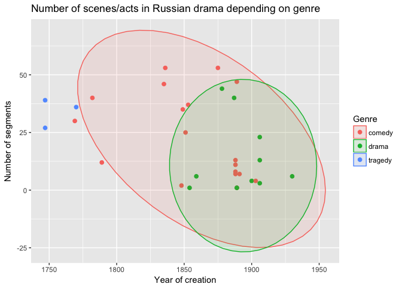

Drama Analysis
================
Ira Pavlova
08.05.2017

### This project is devoted to studying the evolution of Russian drama. The study is based on the Russian Drama Corpus which now contains 49 Russian plays encoded in TEI. The creation time of plays ranges from 1747 to 1925.

``` r
library(tidyverse)
library(plotly)
library(plotrix) 
setwd('/Users/IrinaPavlova/Desktop/Uni/Бакалавриат/2015-2016/Programming/github desktop/RusDraCor/Calculating_stuff_in_plays')
data = read.csv('calculations.csv', stringsAsFactors=FALSE)
data = data.frame(data)
data[data=="empty weights"] <- 0
data[, 5:6] <- sapply(data[, 5:6], as.numeric)
data
```

### This graph shows how the number of characters in plays was changing from 1750 to 1950. The observations are the mean number of characters in plays of a particular year.

``` r
char_data <- aggregate(data[, 4], list(Year_of_creation=data$Year_of_creation), mean)
BG <- subset(char_data, Year_of_creation == "1825")

char_data %>% ggplot(aes(Year_of_creation, x)) +
  geom_point() +
  geom_line() + scale_x_continuous(breaks=seq(1700, 1950, 50)) +
  geom_text(data=BG, label="Boris Godunov", vjust=1) +
  labs(title='Number of characters in Russian drama',
       x='Number of characters', y='Year of creation')
```


### This graph shows how the number of scenes/acts in plays was changing from 1750 to 1950. The observations are the mean number of scenes/acts in plays of a particular year.

``` r
scenes_data <- aggregate(data[, 3], list(Year_of_creation=data$Year_of_creation), mean)
BG <- subset(char_data, Year_of_creation == "1825")

scenes_data %>% ggplot(aes(Year_of_creation, x)) +
  geom_point() +
  geom_line() + scale_x_continuous(breaks=seq(1700, 1950, 50)) +
  labs(title='Number of scenes/acts in Russian drama',
       x='Number of scenes/acts', y='Year of creation')
```



### This graph shows how the maximum degree of a character in plays was changing from 1750 to 1950. The observations are the mean number of max degree in plays of a particular year.

``` r
degree_data <- aggregate(data[, 6], list(Year_of_creation=data$Year_of_creation), mean)

degree_data %>% ggplot(aes(Year_of_creation, x)) +
  geom_point() +
  geom_line() + scale_x_continuous(breaks=seq(1700, 1950, 50)) +
  geom_text(data=BG, label="Boris Godunov", vjust=1) +
  labs(title='Max degree in Russian drama',
       x='Max degree', y='Year of creation')
```


